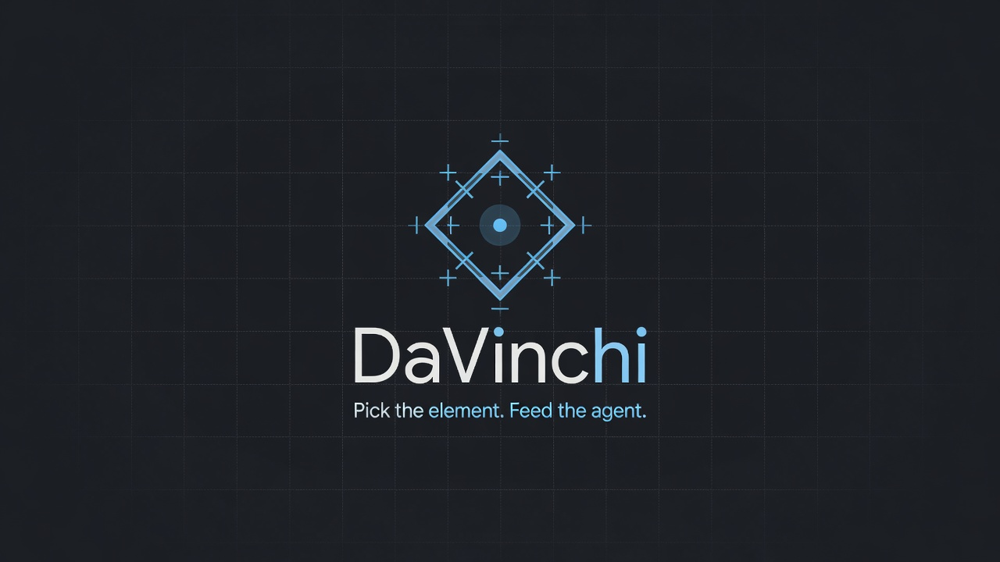

<p align="center">
  
</p>

<h1 align="center">DaVinchi</h1>

<p align="center">
  <strong>Element Picker for VS Code &amp; Cursor</strong><br />
  Click a DOM element → screenshot + HTML/CSS context → feed any terminal AI agent.
</p>

<p align="center">
  <a href="#install">Install</a>
  ·
  <a href="#quick-start">Quick start</a>
  ·
  <a href="#working-on-a-remote-server">Remote server</a>
  ·
  <a href="#settings">Settings</a>
  ·
  <a href="#troubleshooting">Troubleshooting</a>
  ·
  <a href="CHANGELOG.md">Changelog</a>
  ·
  <a href="docs/INSTALL.ru.md">Русская инструкция</a>
</p>

<p align="center">
  
  
  
  
</p>

---

## Why DaVinchi?

AI agents fix UI better when they **see** the element, not only a description of it.

DaVinchi opens a real Google Chrome window, lets you click any DOM node, and writes ready-to-paste artifacts for Claude Code, Cursor agents, Codex, and other terminal tools.

| Artifact | What it holds |
|----------|---------------|
| `element.png` | Cropped screenshot of the target |
| `context.md` | Selector, HTML path, outerHTML, matched CSS, resolved styles, canvas metrics |
| Terminal + clipboard | Paths ready to `@mention` or paste into any agent |

No Copilot lock-in. Agent-agnostic.

---

## Install

Download **`element-picker-0.1.32.vsix`** from the [latest release](https://github.com/Ydjin1984/DaVinci_element_picker/releases/latest), then run **on your own computer**:

```powershell
code --install-extension element-picker-0.1.32.vsix --force
# Cursor:
cursor --install-extension element-picker-0.1.32.vsix --force
```

Or through the UI: Extensions (`Ctrl+Shift+X`) → `⋯` → **Install from VSIX…** → reload the window.

### Requirements

- VS Code **1.85+** or Cursor
- **Google Chrome**
- An open **workspace folder** — picks are saved inside the project

> **Where to install it.** Install DaVinchi on the machine **you are sitting at**. That machine has the browser, and the browser is what the picker drives. This holds even when your project lives on an SSH server: the extension still saves every pick into the server-side project. See [Working on a remote server](#working-on-a-remote-server) if you would rather run the extension on the server itself.

---

## Quick start

1. Open the **DaVinchi** icon in the Activity Bar, then the **Controls** view.
2. **Open browser** → paste any URL.
3. **Select mode** (`Ctrl+Shift+E`) → hover → click an element.
   Or **Clone mode** (`Ctrl+Shift+Alt+C`) for a full pack (HTML/CSS/assets).
4. Files land in your project:

```text
.element-picks/<timestamp>/context.md
.element-picks/<timestamp>/element.png
.element-picks/latest/          → last pick (or clone pack)
```

5. The paths are inserted into the active terminal and the clipboard — add your question and send it to the agent.

| Shortcut | Action |
|----------|--------|
| `Ctrl+Shift+E` | Toggle Select mode |
| `Ctrl+Shift+Alt+C` | Toggle Clone mode |
| `Ctrl+Shift+Alt+E` | Action menu (also in the status bar) |

The panel, status bar, Controls tree, and action menu all show a **version badge** such as `v0.1.32 · ui · win32`. The middle part tells you where the extension is running: `ui` = your machine, `workspace` = the SSH server.

---

## What you get

### Real capture (canvas chart)

<p align="center">
  
</p>

### Context the agent actually needs

- **HTML Path** with ids (`div#mainChart > … > canvas`)
- **Matched CSS** with sources, media queries, children and variants
- **Resolved values** filtered to non-defaults
- **Canvas metrics** — CSS box vs bitmap vs `devicePixelRatio`

```markdown
Element: canvas
HTML Path: div#mainChart > … > canvas

Canvas metrics:
- CSS box: 1635×840
- bitmap (canvas.width×height): 1635×840
- devicePixelRatio: 1
- scale (bitmap/CSS): 1×1 (expected ≈ 1)
- status: ok
```

### Tabs / layout elements

<p align="center">
  
</p>

---

## Working on a remote server

Your project is on an SSH host, but the browser has to be on your screen. Two setups do that, and both save picks into the server-side project. Pick one.

### A. Extension on your machine — recommended, nothing to configure

Install the VSIX **locally** (the command above, run on your own PC — not from an SSH window). Open the remote folder as usual; the badge shows `ui`. Press **Open browser** and Chrome starts right there on your desktop. Picks are written straight into the remote project through the editor's own file API.

Nothing else is needed: no tunnels, no ports, no extra processes.

> If the badge shows `workspace · linux`, the extension is installed on the server instead. Either uninstall it there (Extensions view → the entry under “SSH: … — Installed” → Uninstall), or switch to setup B below.

### B. Extension on the server — one command to prepare your PC

Choose this when the extension itself should live on the SSH host. It cannot launch a browser on your machine directly, so it drives the browser over a debug port that SSH forwards back to you.

**Step 1 — on the server:** install the VSIX in the SSH window (Extensions → Install from VSIX), or from your PC:

```powershell
code --remote ssh-remote+<host> --install-extension element-picker-0.1.32.vsix --force
```

**Step 2 — on your PC (Windows), one command:**

```powershell
# from the cloned repo
.\scripts\setup-windows-cdp.ps1 -SshHost <host>

# or without cloning
iwr -useb https://raw.githubusercontent.com/Ydjin1984/DaVinci_element_picker/main/scripts/setup-windows-cdp.ps1 -OutFile "$env:TEMP\davinchi-setup.ps1"
& "$env:TEMP\davinchi-setup.ps1" -SshHost <host>
```

No administrator rights needed. It sets up:

| What | Why |
|------|-----|
| `%LOCALAPPDATA%\DaVinchi\start-chrome-cdp.cmd` | starts Chrome with `--remote-debugging-port=9222` in a **separate profile** — since Chrome 136 the debug port is refused on your everyday profile |
| Startup entry | Chrome is ready right after you log in |
| Scheduled task `DaVinchi Chrome CDP` | brings it back within 2 minutes if you close it |
| URI handler `davinchi-chrome:` | lets **Open browser** on the server start that Chrome on your PC |
| `RemoteForward 9222` in `~/.ssh/config` | the server reaches your debug port (added for the host you name) |

**Step 3:** reconnect the SSH window. The tunnel is created when the connection is made, so a window reload is not enough.

Then press **Open browser**. If Chrome is not running, the extension asks your machine to start it and waits for it.

To undo everything: `.\scripts\setup-windows-cdp.ps1 -Uninstall`.

macOS/Linux clients: the helper script is Windows-only for now, but the mechanism is portable — start Chrome with `--remote-debugging-port=9222 --user-data-dir=<separate dir>` and add `RemoteForward 9222 localhost:9222` to `~/.ssh/config`.

---

## Features

- Playwright session — Google Chrome / Chromium
- Hover highlight and one-click capture
- **Select** and **Clone** modes (clone pack with granular settings)
- Rich CSS collection: sources, media queries, children, pseudo-states
- Canvas / DPR metrics for chart-heavy UIs
- Multi-language UI (18 locales)
- Version badge in panel, status bar, Controls, action menu
- Controls tree + command palette + status bar (no Service Worker dependency)
- Optional rich webview UI, editor panel, and a cache repair command

---

## Commands

| Command | Description |
|---------|-------------|
| `DaVinchi: Open Panel` | Focus the Controls view |
| `DaVinchi: Open Browser` | Open a URL in the managed browser |
| `DaVinchi: Toggle Select Mode` | `Ctrl+Shift+E` |
| `DaVinchi: Toggle Clone Mode` | `Ctrl+Shift+Alt+C` |
| `DaVinchi: Show Action Menu` | `Ctrl+Shift+Alt+E` |
| `DaVinchi: Attach Last Pick to Terminal` | Paste the paths into the active terminal |
| `DaVinchi: Copy Last Paths to Clipboard` | Copy the attach block |
| `DaVinchi: Reveal Last Pick Folder` | Open the last capture folder |
| `DaVinchi: Close Browser` | Disconnect / close the managed session |
| `DaVinchi: Open Rich UI in Editor` | Editor webview panel |
| `DaVinchi: Reload Webview UI` | Remount if the webview gets stuck |
| `DaVinchi: Fix Webview Cache` | Repair the Service Worker cache (Windows) |
| `DaVinchi: Select Language` | UI language (saved in User settings) |
| `DaVinchi: Start Local Chrome (CDP)` | Start Chrome with the debug port |
| `DaVinchi: Copy Local Chrome CDP Command` | Copy that start script to the clipboard |

---

## Settings

| Setting | Default | Meaning |
|---------|---------|---------|
| `elementPicker.language` | `en` | UI language, 18 locales (`ca` … `zh-TW`) |
| `elementPicker.defaultUrl` | *(empty)* | Optional preferred URL |
| `elementPicker.outputDir` | `.element-picks` | Save folder, workspace-relative |
| `elementPicker.autoAttach` | `true` | Terminal + clipboard after each pick |
| `elementPicker.terminalPrompt` | *(localized)* | Prefix before the paths |
| `elementPicker.maxHtmlBytes` | `100000` | `outerHTML` truncation size in `context.md` |
| `elementPicker.browserMode` | `auto` | `auto` / `launch` / `cdp` |
| `elementPicker.cdpEndpoint` | `http://localhost:9222` | Debug endpoint. Chrome answers on `localhost`, **not** on `127.0.0.1` |
| `elementPicker.browserChannel` | `chrome` | `chrome` / `chromium` |
| `elementPicker.browserPath` | *(empty)* | Full path to `chrome.exe` / `google-chrome` if discovery fails |
| `elementPicker.cloneZip` | `false` | Write `clone.zip` |
| `elementPicker.cloneLatest` | `true` | Mirror the pack into `latest/` |
| `elementPicker.clonePreviewHtml` | `true` | Self-contained `clone/preview.html` |
| `elementPicker.cloneAssets` | `true` | Download images/fonts/icons |
| `elementPicker.clonePageScreenshot` | `true` | Full-page `page.png` |
| `elementPicker.cloneParentScreenshot` | `true` | Parent-area `parent.png` |
| `elementPicker.cloneComputedJson` | `true` | `computed.json` + `fonts.json` |
| `elementPicker.cloneInlineSvgs` | `true` | Write inline SVG files |
| `elementPicker.cloneFullSite` | `false` | Capture the whole page on any click |
| `elementPicker.cloneOneShot` | `false` | Leave Clone mode after one capture |

Browser settings are application-scoped, so a workspace cannot point the extension at an executable of its choosing. All `clone*` toggles are also editable in the panel's **Clone settings** section.

---

## Troubleshooting

**The badge says `workspace · linux` and Open browser fails.**
The extension is running on the SSH server. Either install it on your own machine (setup A) or prepare your PC with `scripts/setup-windows-cdp.ps1` (setup B).

**“local Chrome is not reachable at http://localhost:9222”.**
The debug Chrome is not running, or the tunnel is missing. Check from the SSH terminal: `curl -s http://localhost:9222/json/version` must print JSON with a `Browser` field. If it does not, run the launcher on your PC and reconnect the SSH window.

**The debug port never answers even though Chrome is open.**
An ordinary Chrome window will not do — since Chrome 136 the debug port is refused on the default profile. Use the launcher, which starts Chrome with a separate profile.

**Chrome keeps closing.**
The watchdog task restores it within two minutes. Closing the last tab closes the window, so keep the `about:blank` tab open.

**Clicks inside an `<iframe>` are not captured.**
Known and deliberate: the picker is injected into the main frame only.

**The webview panel shows a Service Worker error.**
An editor-side limitation, not the picker. Use the **Controls** view or the status-bar menu; the commands **Reload Webview UI** and **Fix Webview Cache** repair it.

---

## Develop

```powershell
git clone https://github.com/Ydjin1984/DaVinci_element_picker.git
cd DaVinci_element_picker
npm install
npm run compile
```

- **F5** → Extension Development Host
- `npm run package` → `element-picker-0.1.32.vsix`
- Preflight checks: `node .claude/skills/davinchi-release/scripts/preflight.js`

Contributions: [CONTRIBUTING.md](CONTRIBUTING.md) · License: [MIT](LICENSE)
