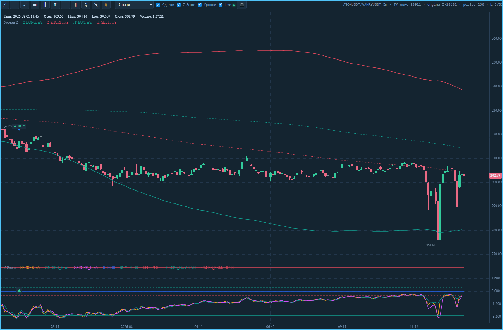
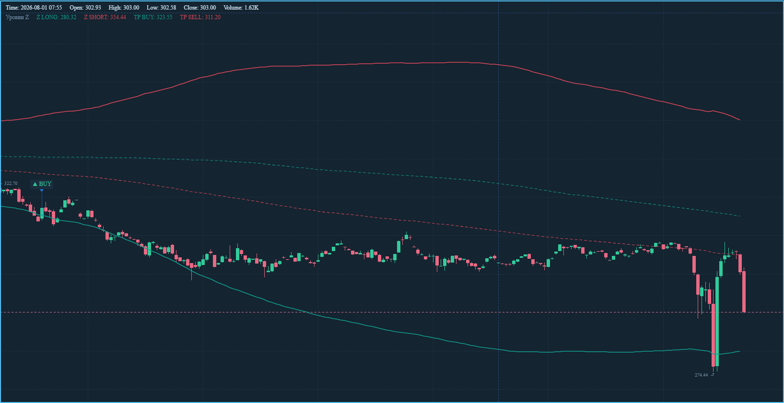
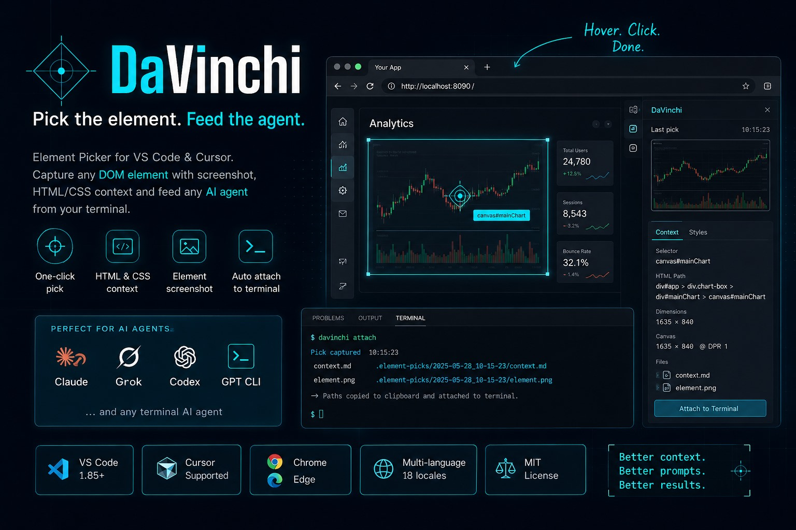

<p align="center">
  
</p>

<h1 align="center">DaVinchi</h1>

<p align="center">
  <strong>Element Picker for VS Code &amp; Cursor</strong><br />
  Click a DOM element → screenshot + HTML/CSS context → feed any terminal AI agent.
</p>

<p align="center">
  <a href="#install">Install</a>
  ·
  <a href="#quick-start">Quick start</a>
  ·
  <a href="#what-you-get">What you get</a>
  ·
  <a href="#features">Features</a>
  ·
  <a href="CHANGELOG.md">Changelog</a>
  ·
  <a href="docs/INSTALL.ru.md">RU</a>
</p>

<p align="center">
  
  
  
  
</p>

---

## Why DaVinchi?

AI agents fix UI better when they **see** the element — not only a verbal description.

DaVinchi opens a real Chrome/Edge window, lets you click any DOM node, and produces ready-to-paste artifacts for Claude Code, Cursor agents, Codex, Grok, and other terminal tools.

| Artifact | Purpose |
|----------|---------|
| `element.png` | Cropped screenshot of the target |
| `context.md` | Selector, HTML path, outerHTML, matched CSS, resolved styles, canvas metrics |
| Terminal + clipboard | Paths ready to `@mention` or paste into any agent |

No Copilot lock-in. Agent-agnostic.

---

## Install

**Current release: `0.1.23`** · package id `coin-rebalancer.element-picker`

### From VSIX (recommended)

1. Download **`element-picker-0.1.23.vsix`** from [Releases](https://github.com/Ydjin1984/DaVinci_element_picker/releases) or build locally.
2. VS Code / Cursor → Extensions (`Ctrl+Shift+X`) → `⋯` → **Install from VSIX…**
3. Reload the window.

CLI:

```powershell
code --install-extension ".\element-picker-0.1.23.vsix" --force
cursor --install-extension ".\element-picker-0.1.23.vsix" --force
```

Step-by-step (RU): [docs/INSTALL.ru.md](docs/INSTALL.ru.md) · short EN: [INSTALL.md](INSTALL.md)

### Requirements

- VS Code **1.85+** or **Cursor**
- **Google Chrome** or **Microsoft Edge**
- An open **workspace folder** (picks are saved under the project)

---

## Quick start

1. Open the **DaVinchi** icon in the Activity Bar.
2. Prefer the **Controls** tree (native UI — always works).
3. **Open browser** → paste any URL.
4. **Select mode** (`Ctrl+Shift+E`) → hover → click an element.  
   Or **Clone mode** (`Ctrl+Shift+Alt+C`) for a full pack (HTML/CSS/assets).
5. Files land in:

```text
.element-picks/<timestamp>/context.md
.element-picks/<timestamp>/element.png
.element-picks/latest/          → last pick (or clone pack)
```

6. Paths are inserted into the **active terminal** and **clipboard** — add your question and send to the agent.

| Shortcut | Action |
|----------|--------|
| `Ctrl+Shift+E` | Toggle Select mode |
| `Ctrl+Shift+Alt+C` | Toggle Clone mode |
| `Ctrl+Shift+Alt+E` | Action menu (also status bar) |

The panel, status bar, Controls tree, and action menu show a **version badge**  
(`v0.1.23 · ui|workspace · platform`) so Local vs Remote host is obvious.

---

## What you get

### Real capture (canvas chart)

<p align="center">
  
</p>

### Context the agent actually needs

- **HTML Path** with ids (`div#mainChart > … > canvas`)
- **Matched CSS** with sources, media queries, children & variants
- **Resolved values** filtered to non-defaults
- **Canvas metrics** — CSS box vs bitmap vs `devicePixelRatio`

```markdown
Element: canvas
HTML Path: div#mainChart > … > canvas

Canvas metrics:
- CSS box: 1635×840
- bitmap (canvas.width×height): 1635×840
- devicePixelRatio: 1
- scale (bitmap/CSS): 1×1 (expected ≈ 1)
- status: ok
```

### Tabs / layout elements

<p align="center">
  
</p>

---

## Features

- Playwright session — Chrome / Edge / Chromium
- Hover highlight + one-click capture
- **Select** and **Clone** modes (clone pack with granular settings)
- Rich CSS collection: sources, media, children, pseudo-states
- Canvas / DPR metrics for chart UIs
- Multi-language UI (18 locales)
- **Version badge** in panel, status bar, Controls, action menu
- Controls tree + command palette + status bar (no Service Worker dependency)
- Optional rich webview UI + editor panel + cache repair command

---

## Commands

| Command | Description |
|---------|-------------|
| `DaVinchi: Open Panel` | Focus Controls view |
| `DaVinchi: Open Browser` | Open URL in managed browser |
| `DaVinchi: Toggle Select Mode` | `Ctrl+Shift+E` |
| `DaVinchi: Toggle Clone Mode` | `Ctrl+Shift+Alt+C` |
| `DaVinchi: Show Action Menu` | `Ctrl+Shift+Alt+E` |
| `DaVinchi: Attach Last Pick to Terminal` | Paste paths |
| `DaVinchi: Copy Last Paths to Clipboard` | Copy paths |
| `DaVinchi: Open Rich UI in Editor` | Editor webview panel |
| `DaVinchi: Reload Webview UI` | Remount if webview stuck |
| `DaVinchi: Fix Webview Cache` | Repair SW cache (Windows) |
| `DaVinchi: Select Language` | UI language (User settings) |

---

## Settings

| Setting | Default | Meaning |
|---------|---------|---------|
| `elementPicker.language` | `en` | UI language (`ca` … `zh-TW`) |
| `elementPicker.defaultUrl` | *(empty)* | Optional preferred URL |
| `elementPicker.browserMode` | `auto` | `auto` / `launch` / `cdp` |
| `elementPicker.cdpEndpoint` | `http://127.0.0.1:9222` | CDP endpoint for advanced attach |
| `elementPicker.browserChannel` | `chrome` | `chrome` / `msedge` / `chromium` |
| `elementPicker.outputDir` | `.element-picks` | Save folder (workspace-relative) |
| `elementPicker.autoAttach` | `true` | Terminal + clipboard after pick |
| `elementPicker.terminalPrompt` | *(localized)* | Prefix before paths |
| `elementPicker.maxHtmlBytes` | `100000` | outerHTML truncate size |
| `elementPicker.clone*` | see panel | Granular clone-pack toggles |

`extensionKind` is `ui` + `workspace` so the extension can run on your PC with Remote SSH; picks save into the open workspace.

---

## Develop

```powershell
git clone https://github.com/Ydjin1984/DaVinci_element_picker.git
cd DaVinci_element_picker
npm install
npm run compile
```

- **F5** → Extension Development Host  
- Package: `npm run package` → `element-picker-0.1.23.vsix`  
- Or: `npm run package:out` → `dist/element-picker-0.1.23.vsix`

```jsonc
// .vscode/launch.json
{
  "version": "0.2.0",
  "configurations": [
    {
      "name": "Run DaVinchi Extension",
      "type": "extensionHost",
      "request": "launch",
      "args": ["--extensionDevelopmentPath=${workspaceFolder}"]
    }
  ]
}
```

---

## Brand

<p align="center">
  
</p>

| | |
|--|--|
| **Name** | DaVinchi |
| **Tagline** | Pick the element. Feed the agent. |
| **Mark** | Precision reticle × selection diamond |
| **Palette** | `#0b0e14` · `#4fc3f7` · `#4f8cff` · `#dce3f0` |

More: [docs/BRAND.md](docs/BRAND.md) · OG card: [docs/media/og-card.jpg](docs/media/og-card.jpg)

---

## Architecture

```text
Activity Bar / Commands / Status bar
        │
        ▼
  BrowserSession (Playwright + system Chrome/Edge)
        │  inject picker · screenshot · CDP
        ▼
  contextBuilder / cloneStore → .element-picks/*
        │
        ▼
  ChatBridge → terminal insert + clipboard
```

---

## Troubleshooting

| Symptom | Fix |
|---------|-----|
| Webview “Service Worker / invalid state” | Use **Controls** or **Show Action Menu**. Optional: `DaVinchi: Reload Webview UI` / `Fix Webview Cache` |
| Browser won’t open | Install Chrome or Edge; try `elementPicker.browserChannel` = `msedge` |
| No files written | Open a **workspace folder** first |
| Blurry canvas capture | Check **Canvas metrics** in `context.md` |
| Unsure which host runs the extension | Read the version badge: need `ui` + your desktop OS for local Chrome |

---

## License

[MIT](./LICENSE) © 2026 DaVinchi contributors

---

<p align="center">
  <sub>Built for people who vibe-code UIs with agents — and want the agent to see what they see.</sub>
</p>
